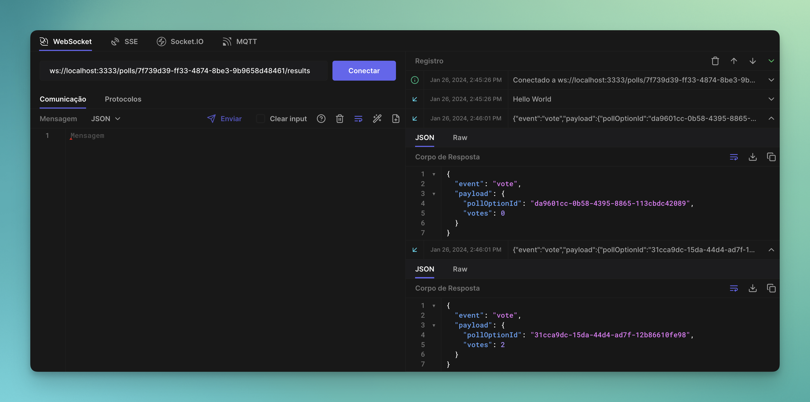

# NLW Expert (Node.js)

A real-time voting system where users can create a poll and other users can cast their votes. The system generates a ranking among the options and updates the votes in real-time.

## Requisites

- Docker;
- Node.js;

## Setup

- Clone the repository;
- Install dependencies (`npm install`);
- Setup PostgreSQL and Redis (`docker compose up -d`);
- Copy `.env.example` file (`cp .env.example .env`);
- Run application (`npm run dev`);
- Test it! (I personally recommend testing with [Hoppscotch](https://hoppscotch.io/)).

## HTTP

### POST `/polls`

Create a new poll.

#### Request body

```json
{
    "title": "Qual melhor framework Node.js",
    "options": ["Fastify", "Express", "NestJS", "HapiJS"]
}
```

#### Response body

```json
{
  "pollId": "a4e5688c-8e59-4439-a359-396b28599fd2"
}
```

### GET `/polls/:pollId`

Return data from a single poll.

#### Response body

```json
{
  "poll": {
    "id": "a4e5688c-8e59-4439-a359-396b28599fd2",
    "title": "Qual melhor framework Node.js",
    "options": [
      {
        "id": "c45f6219-0c3f-4171-8cb4-eadd822cedff",
        "title": "Fastify",
        "score": 1
      },
      {
        "id": "0ef2fcbb-7124-4cbe-8d3b-3f33d8094815",
        "title": "Express",
        "score": 8
      },
      {
        "id": "1af5cba1-8482-45a1-a85d-74c9d09df1d4",
        "title": "NestJS",
        "score": 0
      },
      {
        "id": "d86c3650-a28a-4592-8481-210e3755890e",
        "title": "HapiJS",
        "score": 1
      }
    ]
  }
}
```

### POST `/polls/:pollId/votes`

Add a vote to specific poll.

#### Request body

```json
{
  "pollOptionId": "0ef2fcbb-7124-4cbe-8d3b-3f33d8094815"
}
```

## WebSockets

### ws `/polls/:pollId/results`

#### Message

```json
{
  "pollOptionId": "0ef2fcbb-7124-4cbe-8d3b-3f33d8094815",
  "votes": 5
}
```
<!--START_SECTION:footer-->

<!--END_SECTION:footer-->